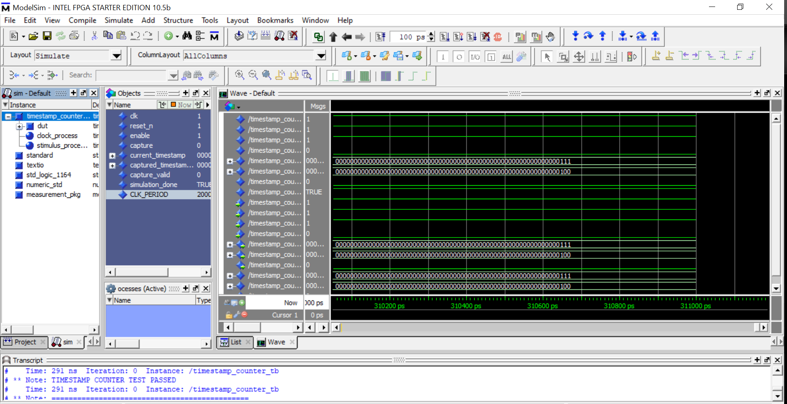
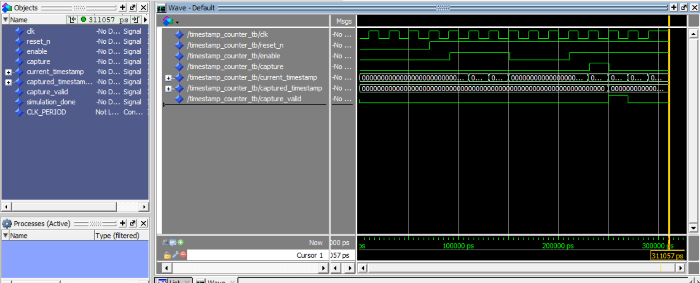

# FPGA Flight Measurement Gateway

A real-time FPGA-based measurement acquisition, signal-processing, and communication gateway implemented using VHDL, Intel Quartus Prime, and embedded C.

The project models a simplified airborne measurement system in which heterogeneous sensor data is acquired, timestamped, processed using fixed-point DSP, buffered, and transferred to an embedded processor through an Avalon Memory-Mapped interface.

## Project Motivation

This project extends FPGA and digital signal-processing work completed during an M.S. Electrical Engineering specialization into a complete portfolio-grade measurement system.

The extended project focuses on:

* FPGA-based measurement acquisition
* deterministic timestamping
* fixed-point digital signal processing
* processor–FPGA integration
* embedded C firmware
* simulation and verification
* timing analysis
* laboratory validation

## Relationship to the Intel DE10 DSP Measurement Project

This project builds upon the FPGA hardware/software co-design platform demonstrated in [`intel-fpga-de10-dsp-measurement`](https://github.com/Vaiy108/intel-fpga-de10-dsp-measurement).

The DE10 project provides a completed and hardware-validated implementation of:

* Intel Platform Designer integration
* Nios II embedded processing
* a custom Avalon-MM VHDL peripheral
* Embedded C firmware
* MATLAB and ModelSim verification
* Quartus synthesis and timing closure
* physical execution on a Terasic DE10-Lite FPGA

The FPGA Flight Measurement Gateway extends that foundation toward a reusable airborne measurement architecture.

Its primary additional focus is:

* deterministic 64-bit timestamping
* channel identification
* structured measurement records
* sequence tracking
* status and diagnostic information
* FIFO-based measurement buffering
* scalable acquisition interfaces
* system-level verification and requirement traceability

The two projects demonstrate complementary parts of a complete FPGA-based measurement system rather than duplicate implementations.

--- 

## Planned System Features

* Sample-based measurement input
* Pulse-frequency measurement
* Digital discrete-input acquisition
* UART-based sensor interface
* 64-bit deterministic timestamping
* Fixed-point FIR filtering
* Configurable decimation
* RMS and signal-power estimation
* Threshold and saturation monitoring
* Measurement FIFO buffering
* Avalon-MM control and status interface
* Nios II embedded C firmware
* UART and Ethernet telemetry
* MATLAB reference model
* Self-checking VHDL testbenches
* Quartus timing and resource analysis
* FPGA hardware validation

## Target Toolchain

| Area                | Technology                           |
| ------------------- | ------------------------------------ |
| FPGA vendor         | Intel/Altera                         |
| FPGA development    | Intel Quartus Prime                  |
| RTL language        | VHDL                                 |
| Simulation          | ModelSim / Questa Intel FPGA Edition |
| Embedded processor  | Nios II                              |
| Embedded software   | C                                    |
| FPGA interconnect   | Avalon-MM                            |
| Reference modelling | MATLAB or GNU Octave                 |
| Hardware validation | Intel/Altera FPGA development board  |

## High-Level Data Flow

```text
Measurement Sources
        |
        v
Acquisition Interfaces
        |
        v
Timestamping and Channel Alignment
        |
        v
Fixed-Point DSP Processing
        |
        v
Measurement FIFO
        |
        v
Avalon-MM Peripheral
        |
        v
Nios II Embedded Firmware
        |
        v
UART / Ethernet Host Interface
```

## Timestamp Counter Verification

The first RTL module implemented in this project is a reusable 64-bit timestamp counter used to provide deterministic timestamps for every acquired measurement.

The module was verified using a self-checking VHDL testbench in ModelSim.

Verification includes:

- Reset behavior
- Counter increment while enabled
- Counter hold while disabled
- Timestamp capture
- Single-cycle `capture_valid` pulse
- Counter continuity after capture

All verification tests completed successfully with no assertion failures.

### ModelSim Verification



### Capture Event Waveform

The waveform below shows the timestamp capture operation. The free-running counter continues to increment while the captured timestamp is latched for downstream processing.




## Repository Structure

```text
fpga-flight-measurement-gateway/
├── docs/               System requirements and design documentation
├── firmware/           Nios II embedded C software
├── hardware_test/      Laboratory test procedures and captures
├── host/               Python, Java, and Linux host-side tools
├── matlab/             Reference models and test-vector generation
├── quartus/            Quartus project files and constraints
├── rtl/                Synthesizable VHDL source code
├── scripts/            Build and simulation scripts
└── tb/                 VHDL testbenches and test data
```

## Development Approach

The project is developed incrementally. Each major feature is implemented and verified in a separate Git commit.

The intended sequence is:

1. Define system requirements and architecture
2. Create common VHDL types and interfaces
3. Implement deterministic timestamping
4. Implement measurement records and buffering
5. Implement fixed-point DSP blocks
6. Create MATLAB reference models
7. Integrate an Avalon-MM peripheral
8. Develop Nios II firmware
9. Perform synthesis and timing analysis
10. Validate the system on FPGA hardware

## Current Status

**Current milestone**

- ✅ System requirements and architecture completed
- ✅ Common measurement package implemented
- ✅ 64-bit timestamp counter implemented and verified
- ✅ Measurement record builder implemented
- In-progress: FIFO buffering and Avalon-MM interface in progress

Next steps include measurement record generation, FIFO buffering, and Avalon-MM integration.

## Project Origin

The project builds upon FPGA, Quartus Prime, digital design, and signal-processing experience developed during an M.S. Electrical Engineering specialization.

The present repository is an independent extension intended to demonstrate a complete FPGA-based measurement system, including additional RTL, verification, firmware integration, diagnostic features, timing analysis, and hardware testing.
