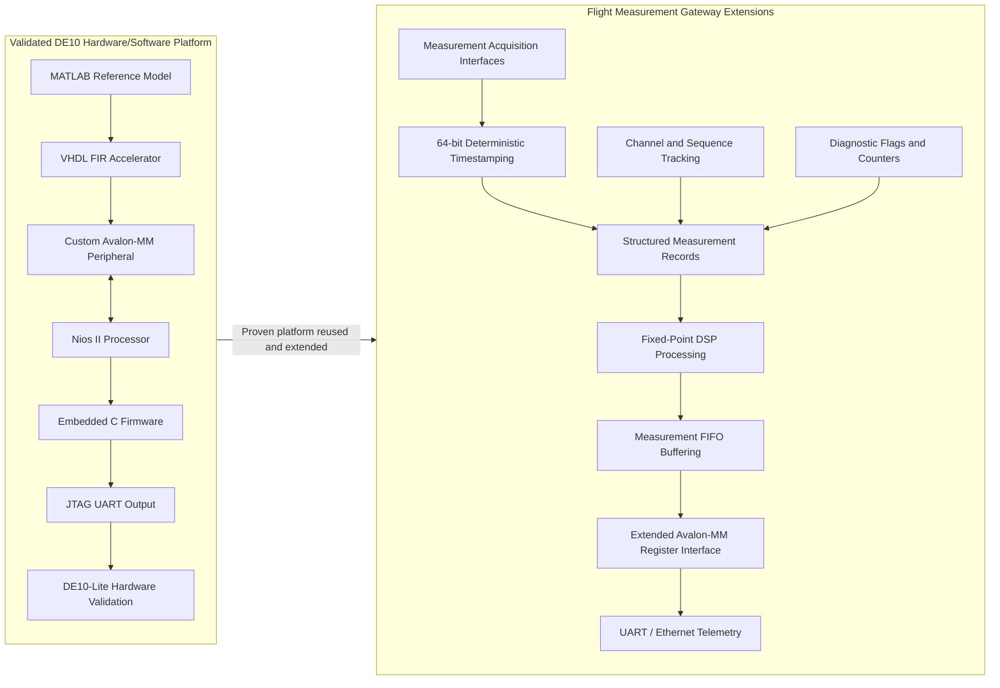

# System Architecture

## 1. Architectural Overview

The FPGA Flight Measurement Gateway is organized as a modular acquisition and processing pipeline.

The architecture separates:

* physical or simulated measurement acquisition
* deterministic timing
* digital signal processing
* buffering
* processor communication
* diagnostics
* host communication

This separation allows each module to be implemented and verified independently before complete-system integration.

---

## 2. Top-Level Architecture

```text
+---------------------------------------------------------------+
|                    Intel/Altera FPGA                          |
|                                                               |
|  +-------------------+                                        |
|  | Measurement Input |                                        |
|  | Interfaces        |                                        |
|  |                   |                                        |
|  | - Sample stream   |                                        |
|  | - Pulse input     |                                        |
|  | - UART sensor     |                                        |
|  | - Discrete input  |                                        |
|  +---------+---------+                                        |
|            |                                                  |
|            v                                                  |
|  +-------------------+        +---------------------------+    |
|  | Input Validation  |------->| Diagnostic Monitor        |    |
|  | and Synchronizer  |        |                           |    |
|  +---------+---------+        | - Interface errors        |    |
|            |                  | - Overflow counters       |    |
|            v                  | - Saturation flags        |    |
|  +-------------------+        +-------------+-------------+    |
|  | Timestamp and     |                      |                  |
|  | Record Formation  |<---------------------+                  |
|  +---------+---------+                                         |
|            |                                                   |
|            v                                                   |
|  +-------------------+                                         |
|  | Fixed-Point DSP   |                                         |
|  |                   |                                         |
|  | - FIR filter      |                                         |
|  | - Decimation      |                                         |
|  | - RMS estimator   |                                         |
|  | - Threshold check |                                         |
|  +---------+---------+                                         |
|            |                                                   |
|            v                                                   |
|  +-------------------+                                         |
|  | Measurement FIFO  |                                         |
|  +---------+---------+                                         |
|            |                                                   |
|            v                                                   |
|  +-------------------+                                         |
|  | Avalon-MM Slave   |                                         |
|  | Registers         |                                         |
|  +---------+---------+                                         |
|            |                                                   |
+------------|---------------------------------------------------+
             |
             v
+-----------------------------+
| Nios II Embedded Processor  |
|                             |
| - FPGA configuration        |
| - FIFO servicing            |
| - Diagnostic handling       |
| - Telemetry framing         |
| - Command interface         |
+-------------+---------------+
              |
              v
+-----------------------------+
| Host Computer               |
|                             |
| - UART/Ethernet receiver    |
| - Measurement logging       |
| - Visualization             |
| - Test automation           |
+-----------------------------+
```

---

## 3. Initial Implementation Scope

The complete architecture contains several planned interfaces, but implementation will begin with one simple measurement path:

```text
Testbench Sample Source
        |
        v
Measurement Input Interface
        |
        v
64-bit Timestamp Capture
        |
        v
Measurement Record Formation
        |
        v
FIFO
```

The DSP chain, Avalon-MM interface, Nios II software, and hardware interfaces will be integrated incrementally.

This staged approach reduces integration risk and provides a clear verification point after every module.

---

## 3.1 Reuse of Existing DE10 Platform

The FPGA Flight Measurement Gateway is designed as an extension of the hardware/software co-design techniques demonstrated in the related [`intel-fpga-de10-dsp-measurement`](https://github.com/Vaiy108/intel-fpga-de10-dsp-measurement) project.

The previous project successfully demonstrated:

* Intel Platform Designer (Qsys)
* Nios II soft processor integration
* Custom Avalon-MM peripheral development
* Embedded C firmware
* MATLAB and ModelSim verification
* Quartus Prime synthesis and timing closure
* FPGA programming and hardware validation on the Terasic DE10-Lite platform

Rather than duplicating those capabilities immediately, this repository first focuses on implementing the reusable measurement front-end architecture.

The initial implementation therefore concentrates on:

* deterministic timestamp generation
* measurement-record formation
* sequence tracking
* measurement FIFO buffering
* diagnostic infrastructure

After these reusable modules have been individually verified, they will be integrated with an Avalon-MM interface and the proven Nios II hardware/software architecture developed in the related DE10 project.

This staged approach keeps the repository modular, avoids unnecessary duplication, and reflects a realistic FPGA system-development workflow where reusable infrastructure is extended with application-specific functionality.

## 3.2 Project Evolution

The FPGA Flight Measurement Gateway evolves from the hardware/software co-design platform demonstrated in the related [`intel-fpga-de10-dsp-measurement`](https://github.com/Vaiy108/intel-fpga-de10-dsp-measurement) project.

The earlier project proves the processor, bus, DSP, firmware, and FPGA deployment workflow. The present project extends that foundation with the timing, buffering, diagnostics, and data-management functions required for a more complete measurement system.



### Evolution Summary

The development progression is:

```text
Hardware-accelerated FIR processing
        |
        v
Validated Avalon-MM and Nios II integration
        |
        v
Deterministic timestamped measurement acquisition
        |
        v
Structured and buffered measurement records
        |
        v
Diagnostics, telemetry, and complete system validation
```

This evolution avoids duplicating already validated processor and bus-integration work while adding the system-level functionality required for a reusable FPGA-based airborne measurement architecture.

---


## 4. Module Decomposition

### 4.1 Common Package

Planned file:

```text
rtl/packages/measurement_pkg.vhd
```

Responsibilities:

* common constants
* channel identifiers
* status-bit definitions
* measurement-record type
* fixed-point type definitions
* utility functions

The package prevents duplicated type definitions across the design.

---

### 4.2 Timestamp Counter

Planned file:

```text
rtl/timing/timestamp_counter.vhd
```

Responsibilities:

* maintain a 64-bit free-running timestamp
* reset deterministically
* increment at the configured timestamp rate
* expose the current timestamp
* capture timestamps for accepted measurements
* later support external synchronization

Initial interface concept:

```text
Inputs:
- clock
- reset
- capture_enable

Outputs:
- current_timestamp
- captured_timestamp
- captured_valid
```

---

### 4.3 Measurement Acquisition

Planned directory:

```text
rtl/acquisition/
```

Planned modules:

```text
sample_stream_input.vhd
pulse_measurement.vhd
uart_rx.vhd
discrete_input_filter.vhd
spi_adc_master.vhd
```

The first implemented acquisition block will be a simple sample-stream interface.

Conceptual sample interface:

```text
sample_data   : signed(15 downto 0)
sample_valid  : std_logic
sample_ready  : std_logic
channel_id    : unsigned(7 downto 0)
```

A sample transaction is accepted when both `sample_valid` and `sample_ready` are asserted.

---

### 4.4 Measurement Record Formation

The record-formation block combines:

* timestamp
* channel identifier
* measurement data
* status flags
* sequence identifier

Preliminary logical record definition:

```text
timestamp      64 bits
channel ID      8 bits
measurement    16 bits
status flags    8 bits
sequence ID    16 bits
```

Initial total width:

```text
112 bits
```

The final packed layout may include padding to simplify FIFO or processor access.

---

### 4.5 DSP Processing

Planned directory:

```text
rtl/dsp/
```

Planned processing order:

```text
Input Sample
    |
    v
DC Offset Removal
    |
    v
FIR Low-Pass Filter
    |
    v
Configurable Decimator
    |
    v
RMS / Power Estimator
    |
    v
Threshold and Saturation Monitor
```

The first DSP implementation will be a 16-tap fixed-point FIR filter.

Two architectural variants may later be compared:

* fully pipelined parallel FIR
* folded multiply–accumulate FIR

The comparison will consider:

* maximum clock frequency
* latency
* sample throughput
* logic utilization
* DSP block utilization

---

### 4.6 Measurement FIFO

Planned file:

```text
rtl/buffering/measurement_fifo.vhd
```

Responsibilities:

* store completed measurement records
* preserve record ordering
* provide full and empty indicators
* report fill level
* detect overflow attempts
* support processor-side record reading

Initial implementation strategy:

* synchronous FIFO
* single clock domain
* configurable depth
* explicit read and write enables

Cross-clock operation will not be introduced until required.

---

### 4.7 Avalon-MM Peripheral

Planned file:

```text
rtl/bus/measurement_avalon_slave.vhd
```

Responsibilities:

* expose control registers
* expose status registers
* provide FIFO data access
* provide diagnostic access
* support DSP configuration
* generate interrupts

Preliminary register groups:

```text
Control
Status
Sample configuration
DSP configuration
FIFO status
FIFO data
Diagnostic flags
Diagnostic counters
Hardware version
```

The detailed address map will be defined before implementation.

---

### 4.8 Diagnostic Monitor

Planned file:

```text
rtl/diagnostics/error_monitor.vhd
```

Planned diagnostics:

* FIFO overflow
* invalid register access
* UART framing error
* SPI timeout
* timestamp synchronization loss
* DSP saturation
* sample loss

Each diagnostic source may provide:

* sticky status bit
* event counter
* interrupt request
* software-clear input

---

### 4.9 Embedded Firmware

Planned directories:

```text
firmware/drivers/
firmware/application/
firmware/bsp/
```

Firmware responsibilities:

* initialize the FPGA subsystem
* configure control and DSP registers
* service measurement interrupts
* read FIFO records
* monitor diagnostic flags
* package telemetry
* transmit data through UART or Ethernet
* expose a command-line interface

Initial software layering:

```text
Application
    |
    v
Measurement Service
    |
    v
FPGA Hardware Abstraction Layer
    |
    v
Avalon-MM Registers
```

---

## 5. Clock Architecture

The initial design will use a single FPGA clock domain.

Advantages:

* simpler verification
* no initial clock-domain crossing risk
* straightforward timestamp correlation
* easier timing analysis

Initial conceptual clock:

```text
fpga_clk = 50 MHz
```

The actual board oscillator and PLL configuration will be selected after the hardware board is identified.

Future interfaces may require additional clock domains. Any clock-domain crossing shall then use an explicitly documented CDC mechanism such as:

* two-flop synchronization
* pulse synchronization
* asynchronous FIFO
* request/acknowledge handshake

---

## 6. Reset Architecture

The initial design will use a synchronous active-high internal reset.

External board reset behaviour will be adapted in the top-level wrapper.

Reset requirements:

* timestamp returns to zero
* FIFO returns to empty
* sequence identifier returns to zero
* diagnostic flags are cleared
* control registers return to documented values
* no valid output is asserted during reset

A reset synchronizer may be added when the external board reset is asynchronous to the FPGA clock.

---

## 7. Data-Flow Control

Streaming data paths will use a valid/ready handshake where backpressure is required.

A transfer occurs when:

```text
valid = 1 and ready = 1
```

Rules:

* the producer asserts `valid` when data is available
* the producer holds data stable while `valid = 1` and `ready = 0`
* the consumer asserts `ready` when it can accept data
* a transaction is completed only when both are asserted

This convention provides deterministic handling of downstream stalls and FIFO-full conditions.

---

## 8. Fixed-Point Strategy

The initial DSP input format is expected to be:

```text
signed 16-bit
```

A likely interpretation is:

```text
Q1.15
```

The precise fixed-point definition will be confirmed before FIR implementation.

The DSP architecture shall explicitly document:

* input format
* coefficient format
* multiplication width
* accumulator width
* scaling
* rounding
* saturation
* output format

MATLAB or Octave shall be used to verify the selected scaling and quantify fixed-point error.

---

## 9. Verification Architecture

Each synthesizable module will have an associated testbench.

Planned verification flow:

```text
MATLAB / Octave Reference Model
             |
             v
Generated Input and Expected-Output Vectors
             |
             v
Self-Checking VHDL Testbench
             |
             v
Simulation Result
             |
             v
Pass / Fail Report
```

Initial verification sequence:

1. timestamp counter
2. measurement package and record packing
3. FIFO
4. FIR filter
5. complete sample-to-FIFO path
6. Avalon-MM register interface
7. Nios II integration
8. fault-injection scenarios

---

## 10. Hardware Mapping

The primary hardware platform will be an Intel/Altera FPGA development board.

The following information will be added after board identification:

* board name
* FPGA family
* exact FPGA device
* available oscillator frequency
* available UART interface
* available Ethernet interface
* LEDs and switches
* GPIO header details
* external memory
* supported Quartus version

Board-specific logic shall be isolated in the top-level and constraint files so that the core measurement modules remain portable.

---

## 11. Portability

The core RTL shall avoid unnecessary vendor-specific primitives.

Vendor-specific elements will be isolated to:

```text
quartus/
rtl/top/
firmware/bsp/
```

The measurement, DSP, timestamp, FIFO, and diagnostic modules should remain portable to another FPGA platform.

A future Xilinx implementation could replace:

* Avalon-MM with AXI4-Lite or AXI4-Stream
* Nios II with MicroBlaze
* Intel memory or PLL IP with Xilinx equivalents

The core signal-processing functionality should not require redesign.

---

## 12. First RTL Development Target

The first RTL module will be:

```text
rtl/packages/measurement_pkg.vhd
```

It will define the shared measurement types and constants required by subsequent modules.

The first independently functional module will then be:

```text
rtl/timing/timestamp_counter.vhd
```

Its implementation will be followed immediately by a self-checking testbench.
